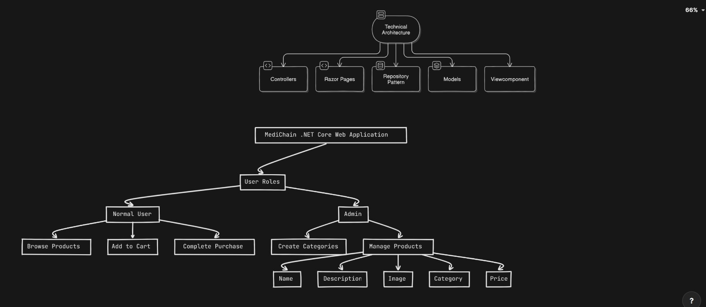
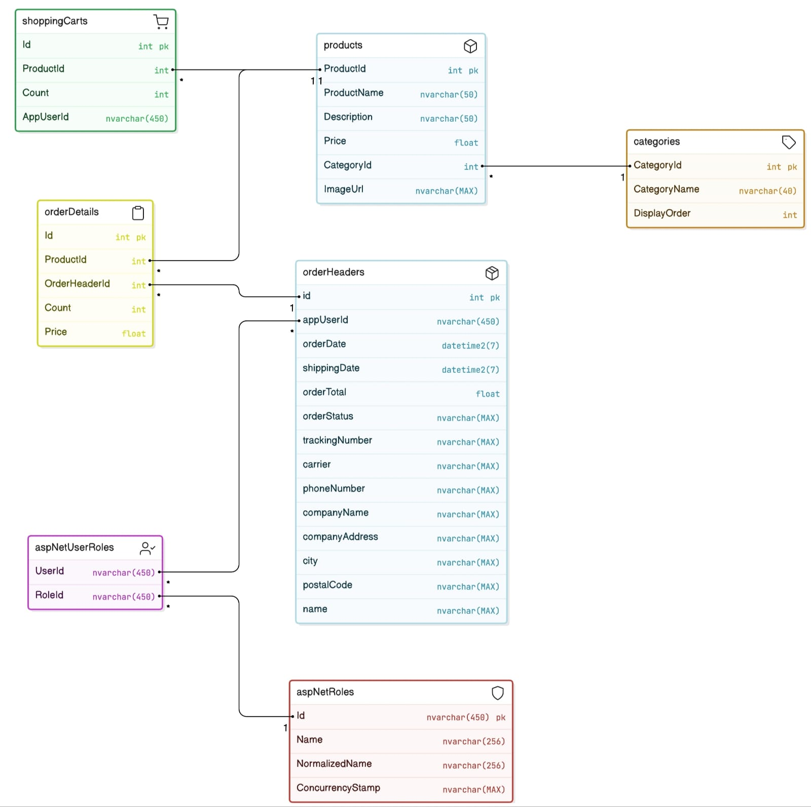

# MediChain

MediChain is a .NET 8.0 web application that manages product data and user authentication using ASP.NET Core Identity. The project is built using Entity Framework Core with support for MSSQL and SQLite databases.

## Features

- User Authentication (Login, Register) via ASP.NET Core Identity
- Product management (CRUD operations on product data)
- Entity Framework Core for data access
- Database support: MSSQL and SQLite
- Pomelo EntityFramework Core for MySQL integration (optional)

## Technologies Used

- .NET SDK 8.0
- ASP.NET Core Identity
- Entity Framework Core
- SQLite (Primary database)
- MSSQL (Optional database configuration)
- Razor Pages
- Microsoft Visual Studio Code / Rider

## MediChain

MediChain is a web application built using ASP.NET Core with Entity Framework Core. This project is designed to work with both MSSQL and SQLite databases. Follow the steps below to set up and run the project.

## Dependencies
- Microsoft.AspNetCore.Identity.EntityFrameworkCore (v8.0.10)
- Microsoft.AspNetCore.Identity.UI (v8.0.10)
- Microsoft.EntityFrameworkCore (v8.0.10)
- Microsoft.EntityFrameworkCore.Sqlite (v8.0.10)
- Microsoft.EntityFrameworkCore.SqlServer (v8.0.10)
- Microsoft.EntityFrameworkCore.Tools (v8.0.10)
- Microsoft.VisualStudio.Web.CodeGeneration.Design (v8.0.6)

## Setup Instructions

### Clone the repository

Clone the repository to your local machine using Git:

```bash
git clone https://github.com/jeetbhuptani/MediChainMVC.git
```

### Navigate to the Project Directory
Once cloned, navigate to the project folder:
```bash
cd MediChain
```

### Install the Required Dependencies
Run the following command to restore all necessary NuGet packages and dependencies:

```bash
dotnet restore
```

### Configure the Database
By default, the project is set up to use MSSQL, but you can configure it to use SQLite as well. To do this, modify the appsettings.json file.

#### For MSSQL (default):
Ensure that the appsettings.json file contains the following configuration:

```bash
"ConnectionStrings": {
  "DefaultConnection": "Server=(localdb)\\MSSQLLocalDB;Database=MediChain;Trusted_Connection=True;TrustServerCertificate=True"
}
```

#### For SQLite:
If you prefer to use SQLite, change the connection string to:

```bash
"ConnectionStrings": {
  "DefaultConnection": "Data Source=MediChain.db"
}
```

Make sure to update the connection string according to your preferred setup.

### Apply Database Migrations
To set up the database schema and apply the migrations, run the following command:

```bash
dotnet ef database update
```

This command ensures that the database is properly created and configured based on the latest migrations.

### Run the Application
After completing all the above steps, you can start the MediChain web application by running the following command:

```bash
dotnet run
```
## System Designs
### Architecture and Work Flow


### Entity Relationship


### Members
<a href="https://github.com/kavyashah26" target="_blank">
    
</a>
<a href="https://github.com/arshgangani" target="_blank">
    
</a>
<a href="https://github.com/jeetbhuptani" target="_blank">
    
</a>
